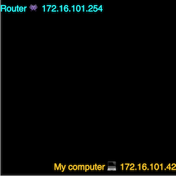

# p5.packets
p5.packets makes network information available as a data source for p5.js sketches.

To do that, p5.packets relies on a local server talking to the network and serving information it collects to a JavaScript client. From there, you can use p5.js functions to consume and process the network data however you want.

# Getting started
1. Clone this repository

## Server
For first-time setup with virtualenv:

1. Open up Terminal and `$ cd server` to get to the `p5.packets/server/` directory
2. `$ virtualenv venv` to create a virtualenv
3. `$ source venv/bin/activate` to activate the virtualenv
4. `$ pip install -r requirements.txt` to install Python dependencies

Start server:

3. `$ python main.py` from `server/src/` directory starts a server on port 8080

## Client

1. In a separate Terminal tab from the server, `cd` to the `p5.packets/client/` directory
2. Run `$ npm install` to install Node.js dependencies
2. Open `p5.packets/client/sample-project/index.html` in your browser

# Examples
```
const hostname = "localhost";
const port = 8080;
const packet = new Sniffer(hostname, port);

function setup() {
  createCanvas(400, 400);
  background(0);
  packet.getNetworkInfo()
}

function draw() {
  const lineHeight = 20
  textSize(lineHeight)
  textAlign(LEFT, CENTER)
    if (packet.networkInfo.gw) {
      const gwString = `Router 👾 ${packet.networkInfo.gw}`
      const gwStringWidth = textWidth(gwString)
      fill(0, 255, 255);
      text(gwString, 0, lineHeight)

      const ifaddrString = `My computer 💻 ${packet.networkInfo.ifaddr}`
      const ifaddrStringWidth = textWidth(ifaddrString)
      fill(255, 204, 0);
      text(ifaddrString, width - ifaddrStringWidth, height - lineHeight)
    }
}
```

<!--  -->


# Development
## Server
- `pip install NEW_PACKAGE && pip freeze > requirements.txt` to save new dependencies

## Client
- `$ npm run build` creates `client/dist/main.js`

## Tests
Uses pytest

- `$ pytest` from `server/` directory runs tests
- add tests to `server/tests/` directory with the naming convention `test_*.py`
